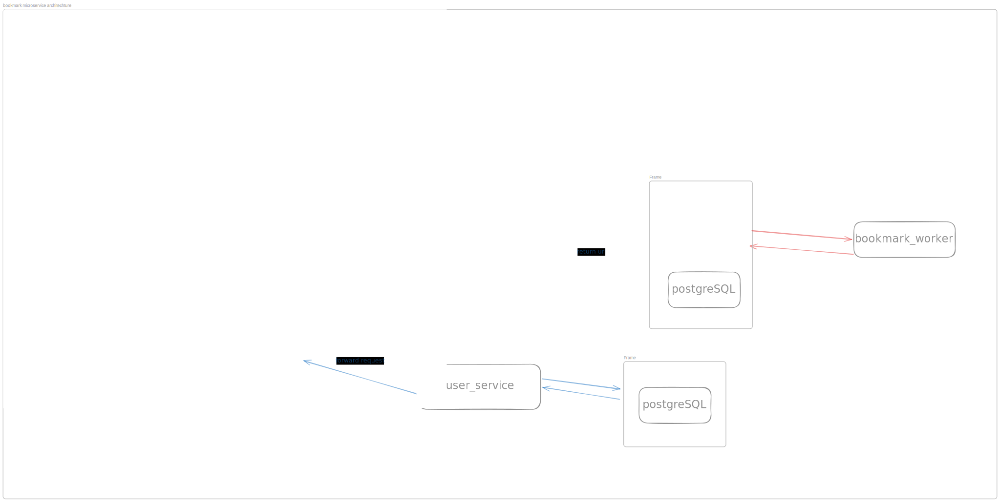

# Bookmark Management — Deployment

Docker Compose deployment configuration for the Bookmark Management system, a full-stack application built with Domain-Driven Design (DDD). It provides URL shortening, bookmark management, and user authentication via a microservices architecture.

---

## Architecture




```
                    ┌──────────────────────────────────────────────────────┐
                    │                  Internet / Client                   │
                    └──────────────────────┬───────────────────────────────┘
                                           │ :80
                    ┌──────────────────────▼───────────────────────────────┐
                    │                     nginx                            │
                    │              (Reverse Proxy / Router)                │
                    │                                                      │
                    │  /                        → portal (frontend)        │
                    │  /api/bookmark_service/*  → bookmark_service         │
                    │  /api/user_service/*      → user_service             │
                    │  /p[base62]               → bookmark_service (301)   │
                    │  /r[8 chars]              → bookmark_service (301)   │
                    └───┬───────────────────┬───────────────────┬──────────┘
                        │                   │                   │
            ┌───────────▼──┐    ┌───────────▼──────┐  ┌────────▼────────┐
            │    portal    │    │   user_service   │  │bookmark_service │
            │  (Frontend)  │    │    :8080         │  │    :8080        │
            │    :3000     │    │                  │  │                 │
            │              │    │ - Register       │  │ - Shorten URL   │
            │ - Login UI   │    │ - Login / JWT    │  │ - Redirect      │
            │ - Bookmarks  │    │ - Update profile │  │ - CRUD bookmarks│
            │ - Shorten URL│    │                  │  │                 │
            └──────────────┘    └────────┬─────────┘  └─────────┬───────┘
                                         │                      │
                              ┌──────────▼──────────────────────▼─────────┐
                              │            bookmark_ddd_network           │
                              │                                           │
                              │  ┌───────────────┐   ┌─────────────────┐  │
                              │  │    redis      │   │    postgres     │  │
                              │  │               │   │                 │  │
                              │  │ - short code  │   │ - "user" db     │  │
                              │  │   → url cache │   │ - "bookmark" db │  │
                              │  └───────────────┘   └─────────────────┘  │
                              └───────────────────────────────────────────┘
```

---

## Services

| Service            | Image                               | Port (internal) | Description                          |
|--------------------|-------------------------------------|-----------------|--------------------------------------|
| `nginx`            | `nginx:alpine`                      | 80 (exposed)    | Reverse proxy, single entry point    |
| `portal`           | `ebvn/bookmark-app-portal:ddd`      | 3000            | Frontend SPA                         |
| `user_service`     | `haihoanguci/user-service:dev`      | 8080            | Auth & user management               |
| `bookmark_service` | `haihoanguci/bookmark-service:dev`  | 8080            | Bookmark & URL shortener             |
| `postgres`         | `postgres:17`                       | 5432            | Persistent storage (2 databases)     |
| `redis`            | `redis:alpine`                      | 6379            | Short URL cache                      |

---

## URL Shortening

Two types of short codes are supported:

| Type       | Pattern                        | Example       | Description                        |
|------------|--------------------------------|---------------|------------------------------------|
| Sequential | `p` + base62 (variable length) | `p0`, `pAb3`  | Auto-incremented, base62-encoded   |
| Random     | `r` + 8 alphanumeric chars     | `rabcd1234`   | Randomly generated                 |

Visiting `http://localhost/p0` or `http://localhost/rabcd1234` will trigger a `301` redirect to the original URL via `bookmark_service`.

---

## Routing (nginx)

| Path pattern              | Upstream           |
|---------------------------|--------------------|
| `/`                       | `portal`           |
| `/api/bookmark_service/*` | `bookmark_service` |
| `/api/user_service/*`     | `user_service`     |
| `/p[a-zA-Z0-9]+`          | `bookmark_service` |
| `/r[a-zA-Z0-9]{8}`        | `bookmark_service` |

Rate limiting is configured (`10 req/min` per IP) on API routes and can be enabled in [nginx/nginx.conf](nginx/nginx.conf).

---

## Authentication (JWT / RSA)

- `user_service` holds the **RSA private key** (`private_key.pem`) — signs JWT tokens on login.
- `bookmark_service` holds only the **RSA public key** (`public_key.pem`) — verifies tokens on protected routes.

---

## Prerequisites

- [Docker](https://docs.docker.com/get-docker/) & [Docker Compose](https://docs.docker.com/compose/)
- `openssl` (for RSA key generation)

---

## Getting Started

### 1. Configure environment files

Create the required `.env` files before starting:

```
postgres/.env
bookmark-service/.env
user-service/.env
```

**`postgres/.env`** (example):
```env
POSTGRES_USER=admin
POSTGRES_PASSWORD=admin
```

### 2. First-time setup (generate keys + start all services)

```bash
make full-deploy
```

This will:
1. Generate a 2048-bit RSA key pair (`private_key.pem`, `public_key.pem`)
2. Start `postgres` and `redis` first (with a 5-second wait for readiness)
3. Start all remaining services

### 3. Start / Stop

```bash
# Start all services
make up

# Stop all services
make down
```

### 4. Regenerate RSA keys only

```bash
make generate-rsa-key
```

> **Note:** Regenerating keys will invalidate all existing JWT tokens. Restart all services after regenerating.

---

## Directory Structure

```
.
├── docker-compose.yaml          # Service definitions
├── Makefile                     # Shortcut commands
├── deploy.sh                    # Ordered startup script
├── nginx/
│   └── nginx.conf               # Reverse proxy configuration
├── postgres/
│   ├── .env                     # Postgres credentials
│   └── init_db/
│       └── init.sql             # Creates "user" and "bookmark" databases
├── bookmark-service/
│   └── .env                     # bookmark_service environment config
├── user-service/
│   └── .env                     # user_service environment config
├── public_key.pem               # RSA public key (shared with services)
├── private_key.pem              # RSA private key (user_service only)
└── pgdata/                      # Postgres persistent data volume
```

---

## Key Flows

**User registration / login**
```
Client → nginx → user_service → postgres("user" db) → JWT (signed with private key)
```

**Add / list bookmarks** *(requires JWT)*
```
Client → nginx → bookmark_service (verify JWT with public key) → postgres("bookmark" db)
```

**Shorten a URL**
```
Client → nginx → bookmark_service → redis (store short_code → original url)
                                  → postgres (persist bookmark record)
```

**Visit a short URL**
```
Client → nginx (/p... or /r...) → bookmark_service → redis (lookup) → 301 redirect
```
